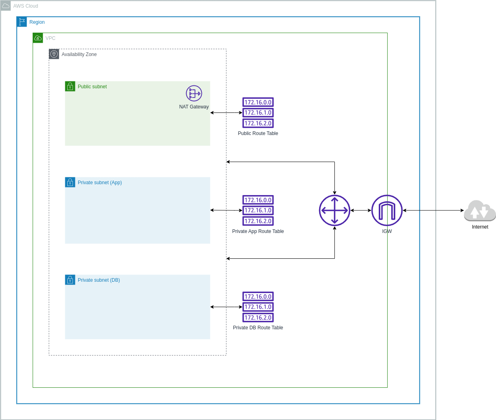

# Base - Network Architecture

Inspried from https://github.com/infrablocks/terraform-aws-base-networking with some modifications to simplify the architecture for learning purposes

This example is going to set up the network architecture from scratch without using [Terraform modules](https://developer.hashicorp.com/terraform/language/modules)

