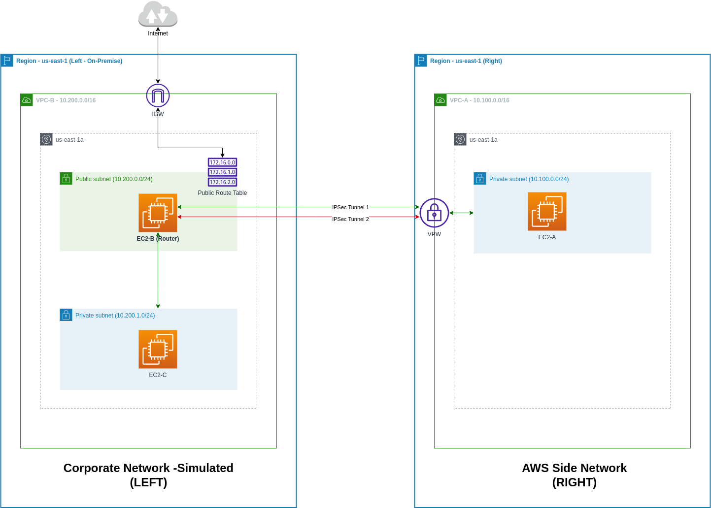

# Site-To-Site VPN Practice

## About the example



- Set up the VPN site-to-site connection by Terraform
- Simulate the on-premises network in AWS `us-east-1` region
- AWS side network in AWS `us-east-1` region
- Use [OpenSwan](https://openswan.org/) as the VPN software and automate steps to set up and configure it via Terraform
- In this example, we use AWS VPW static routing

## Watch Tutorial

Thanks `Chetan` for his excellent videos. Please watch the video guide to understand how it works.

Part 1: https://www.youtube.com/watch?v=5YvcyBecQts

Part 2: https://www.youtube.com/watch?v=vfSsYBWyovQ

Then move to the [Getting Started](#getting-started) section below.

## Getting Started

### Step 1: Set up Site B

```bash
cd networking/site-to-site-vpn/site-b
```

Create your `terraform.tfvars`:

```
# Access info
myipv4       = "<your public IP address>/32"
mypublic_key = "<your ssh public key>"

# VPC B
region          = "us-east-1"
vpc_cidr        = "10.200.0.0/16"
vpc_azs         = ["us-east-1a"]
public_subnets  = ["10.200.0.0/24"]
private_subnets = ["10.200.1.0/24"]
# VPC A
vpc_a_cidr      = "10.100.0.0/16"
```

Init the infrastructure:

```bash
terraform init
terraform apply
```

### Step 2: Set up Site A

```bash
cd networking/site-to-site-vpn/site-a
```

Create your `terraform.tfvars`:

```
# VPC A
region          = "us-east-1"
vpc_cidr        = "10.100.0.0/16"
vpc_azs         = ["us-east-1a"]
private_subnets = ["10.100.0.0/24"]

# VPC B
vpc_b_cidr = "10.200.0.0/16"
cgw_ip     = "<your-ec2-b-elastic-ip-address>"
```

### Step 3: Update Site B

Populate your `site-b/terraform.tfvars` with the downloaded VPN configuration for the EC2-B instance and apply.

```
ec2_b_ip            = "<your-ec2-b-elastic-ip-address>"
vpc_a_tunnel_1_ip   = "<your-tunnel-1-ip-address>"
preshared_key       = "<your-tunnel-1-preshared-key>"
```

### Step 4: Test the VPN connection

```bash
# SSH to EC2-B instance
ssh ec2-user@<your-ec2-b-elastic-ip-address>

# Try to ping the EC2-A
ping <ec2-a-private-ip>

# Working, then SSH to EC2-C instance from the EC2-B
# First, you need to create a file to store your private SSH key here
# by copying your local private SSH key and save it
vi ~/.ssh/aws-cloud-pratice.pem
chmod 400 ~/.ssh/aws-cloud-pratice.pem

# Now, you can ssh to the EC2-C
ssh ec2-user@<your-ec2-c-private-ip-address>

# Working, now your are in EC2-C, try to ping the EC2-A
ping <ec2-a-private-ip>

# Working? We're done!
```
